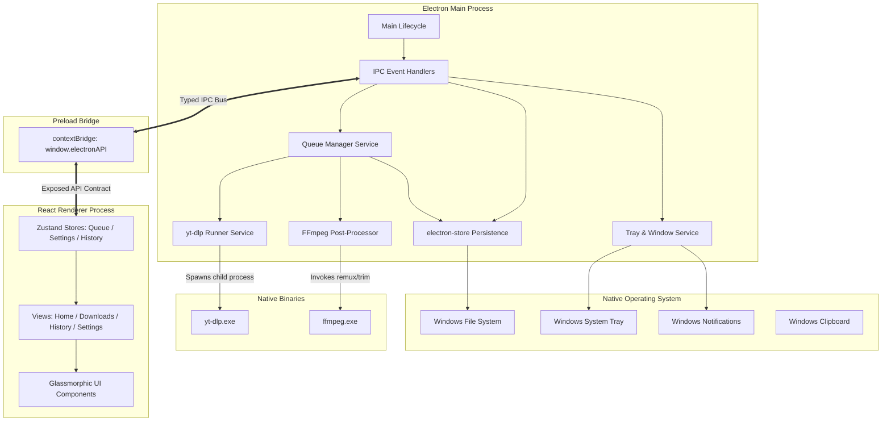
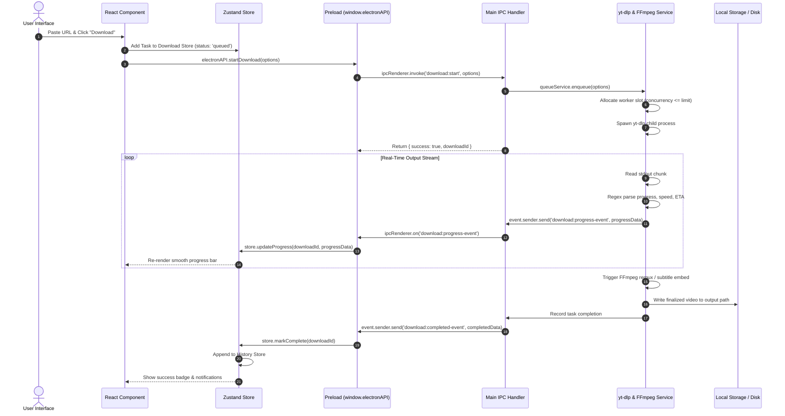
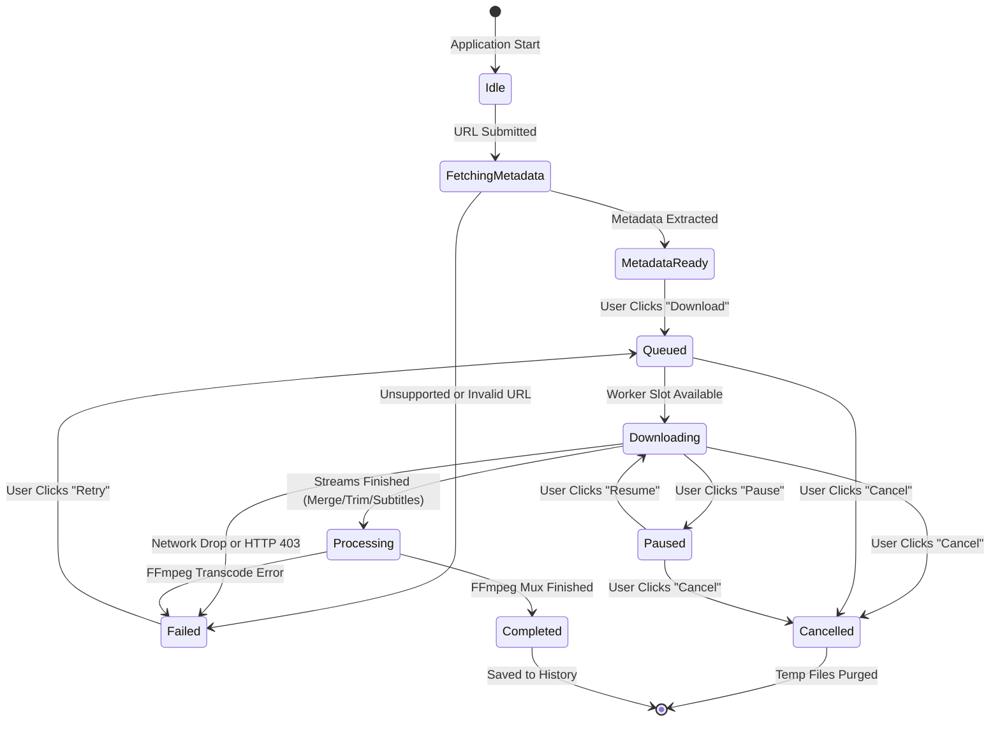

# PullTube — System Architecture & Implementation Design

| Document Version | Status   | Author                 | Date       | Target Release |
| :--------------- | :------- | :--------------------- | :--------- | :------------- |
| 1.0.0            | Approved | Lead Systems Architect | 2026-09-19 | PullTube v1.0  |

---

## 1. Project Directory Structure

The PullTube codebase follows a modular structure, separating Electron main-process system routines, secure preload bindings, React renderer views, and shared TypeScript type contracts.

```
pulltube/
├── .github/                       # CI/CD Workflows & Issue Templates
│   └── workflows/
│       ├── build.yml              # Windows NSIS packaging & release automation
│       └── lint.yml               # Type checking & ESLint gate
├── assets/                        # Static icons, app logo, and tray assets
│   ├── app-icon.ico               # Windows desktop icon
│   ├── app-icon.png               # High-res PNG logo
│   └── tray-icon.png              # System tray grayscale template
├── bin/                           # Bundled native binaries (dev fallback)
│   ├── ffmpeg.exe                 # Static FFmpeg binary
│   ├── ffprobe.exe                # Static FFprobe binary
│   └── yt-dlp.exe                 # Latest release of yt-dlp
├── build/                         # Packaging icons and installer resources
│   ├── icon.ico                   # NSIS setup icon
│   └── installer.nsh              # Custom NSIS installer scripts
├── documents/                     # Project documentation & design specs
│   ├── ARCHITECTURE.md            # System architecture (this document)
│   ├── CHANGELOG.md               # Version release logs
│   ├── CONTRIBUTING.md            # Contributor guidelines
│   ├── DESIGN.md                  # Design system & tokens
│   ├── prd.md                     # Product Requirements Document
│   ├── ROADMAP.md                 # Product roadmap & future versions
│   └── trd.md                     # Technical Requirements Document
├── src/
│   ├── main/                      # Electron Main Process (Node.js runtime)
│   │   ├── index.ts               # Main process entry point & lifecycle
│   │   ├── window.ts              # BrowserWindow factory & event listeners
│   │   ├── tray.ts                # System tray icon & context menu manager
│   │   ├── notification.ts        # Native Windows notification dispatcher
│   │   ├── ipc/                   # Typed IPC Handlers
│   │   │   ├── downloadIpc.ts     # Download start, pause, resume, cancel
│   │   │   ├── settingsIpc.ts     # Configuration get/set & directory picker
│   │   │   ├── ytdlpIpc.ts        # URL metadata extraction & engine update
│   │   │   └── windowIpc.ts       # Titlebar controls (min/max/close)
│   │   ├── services/              # Core business engines
│   │   │   ├── ytdlpService.ts    # yt-dlp child_process execution & parsing
│   │   │   ├── ffmpegService.ts   # FFmpeg post-processing & remuxing
│   │   │   ├── queueService.ts    # Concurrent download queue scheduler
│   │   │   ├── storeService.ts    # electron-store abstraction layer
│   │   │   └── updaterService.ts  # GitHub API binary updater for yt-dlp
│   │   └── utils/                 # Native helper utilities
│   │       ├── binaryPaths.ts     # Dynamic binary path resolver
│   │       ├── parser.ts          # Stdout regex parsing utilities
│   │       └── logger.ts          # Main process logging to file
│   │
│   ├── preload/                   # Electron Preload Script (Bridge)
│   │   ├── index.ts               # contextBridge exposure of window.electronAPI
│   │   └── api.ts                 # Strong typed API contract mapping
│   │
│   ├── renderer/                  # React Renderer Process (Chromium DOM)
│   │   ├── index.html             # Vite entry HTML with strict CSP
│   │   ├── index.tsx              # React DOM root render
│   │   ├── App.tsx                # App shell, router, and modal overlays
│   │   ├── components/            # Reusable UI components
│   │   │   ├── common/            # Primitive atomic components
│   │   │   │   ├── Button.tsx     # Glass & gradient button variants
│   │   │   │   ├── Input.tsx      # Frosted glass text inputs
│   │   │   │   ├── Modal.tsx      # Backdrop blur modal dialogs
│   │   │   │   ├── Toggle.tsx     # Animated switch toggles
│   │   │   │   ├── ProgressBar.tsx# Gradient animated progress bar
│   │   │   │   └── Badge.tsx      # Status & format pill tags
│   │   │   ├── layout/            # Application structural layout
│   │   │   │   ├── Sidebar.tsx    # Left persistent glass navigation
│   │   │   │   ├── Titlebar.tsx   # Custom Windows frameless titlebar
│   │   │   │   └── Toast.tsx      # In-app notifications container
│   │   │   └── download/          # Media download components
│   │   │       ├── UrlBar.tsx     # Link paste bar with auto-detect
│   │   │       ├── MediaCard.tsx  # Extracted video metadata preview
│   │   │       ├── FormatPicker.tsx # Quality and container selector
│   │   │       ├── AdvancedToggles.tsx # Subtitles, trimming, chapters
│   │   │       └── QueueTable.tsx # Live active downloads list
│   │   ├── views/                 # Top-level navigation pages
│   │   │   ├── HomeView.tsx       # Link input & quick download view
│   │   │   ├── DownloadsView.tsx  # Active queue & concurrency manager
│   │   │   ├── HistoryView.tsx    # Completed downloads search & log
│   │   │   └── SettingsView.tsx   # App configuration & yt-dlp updates
│   │   ├── stores/                # Zustand client state stores
│   │   │   ├── downloadStore.ts   # Queue items, progress, active counts
│   │   │   ├── settingsStore.ts   # User settings sync
│   │   │   ├── historyStore.ts    # History items & filters
│   │   │   └── uiStore.ts         # Navigation tabs, active modals
│   │   ├── hooks/                 # Custom React hooks
│   │   │   ├── useClipboard.ts    # Clipboard monitoring & auto-paste
│   │   │   └── useKeyboard.ts     # Global shortcut handlers
│   │   └── styles/                # Styling and fonts
│   │       └── globals.css        # Tailwind directives & glass utility classes
│   │
│   └── shared/                    # Shared TypeScript Types & Constants
│       ├── types/
│       │   ├── ipc.ts             # IPC channel payload contracts
│       │   ├── media.ts           # MediaInfo, formats, subtitles types
│       │   ├── download.ts        # DownloadTask, Queue, Status types
│       │   └── settings.ts        # AppSettings interface
│       └── constants/
│           ├── channels.ts        # String constant names for IPC channels
│           └── defaults.ts        # Default settings and quality fallbacks
│
├── package.json                   # Dependencies, scripts, and build metadata
├── tsconfig.json                  # Root TypeScript configuration
├── tsconfig.node.json             # Main process TS compiler config
├── vite.config.ts                 # Vite bundler configuration for renderer
├── tailwind.config.js             # Tailwind theme colors and glass presets
└── electron-builder.json          # Windows NSIS packaging specifications
```

---

## 2. Module Dependency Graph

The following Mermaid diagram illustrates the dependency flow between external tools, internal services, and UI stores.



---

## 3. Electron Process Model

```
┌────────────────────────────────────────────────────────────────────────┐
│                        MAIN PROCESS (Node.js)                          │
│  • Single Instance Lock (app.requestSingleInstanceLock)                │
│  • Spawns child_process.spawn("yt-dlp.exe", args)                     │
│  • Reads unbuffered stdout/stderr streams                             │
│  • Full access to local file system, OS registry, Tray, Notifications   │
└───────────────────────────────────┬────────────────────────────────────┘
                                    │
                                    │ IPC Channels (Invoke / Send)
                                    ▼
┌────────────────────────────────────────────────────────────────────────┐
│                        PRELOAD ISOLATION LAYER                         │
│  • contextIsolation: true                                              │
│  • nodeIntegration: false                                              │
│  • Validates channel whitelist before calling ipcRenderer              │
└───────────────────────────────────┬────────────────────────────────────┘
                                    │
                                    │ window.electronAPI
                                    ▼
┌────────────────────────────────────────────────────────────────────────┐
│                     RENDERER PROCESS (Chromium DOM)                    │
│  • Sandboxed browser execution context                                 │
│  • React 18 Concurrent Rendering                                       │
│  • UI mutations driven exclusively by Zustand subscriptions            │
│  • Zero direct access to Node.js APIs or shell commands                │
└────────────────────────────────────────────────────────────────────────┘
```

---

## 4. End-to-End IPC Architecture & Flow



---

## 5. Download Lifecycle State Machine

Each download job traverses a deterministic state machine managed by `queueService.ts`.



### State Definitions
- **`Idle`**: No active URL loaded in the input field.
- **`FetchingMetadata`**: `yt-dlp --dump-single-json` running to inspect remote formats.
- **`MetadataReady`**: Video details, resolutions, and options displayed to the user.
- **`Queued`**: Job placed in priority queue, waiting for active download count to drop below `maxConcurrentDownloads`.
- **`Downloading`**: Active network streaming of video and audio streams.
- **`Processing`**: Post-processing execution (FFmpeg muxing, audio extraction, chapter splitting, thumbnail embedding).
- **`Paused`**: `SIGSTOP` sent to process or task queued for resumption.
- **`Completed`**: Target file verified on disk, entry saved into `history.json`.
- **`Failed`**: Download terminated abnormally with error details recorded.
- **`Cancelled`**: Process killed via `SIGKILL`, partial `.part` files purged.

---

## 6. Data Persistence Layer

PullTube uses `electron-store` for thread-safe disk persistence in the user's roaming application directory:
- Windows Path: `C:\Users\<Username>\AppData\Roaming\PullTube\`

```
AppData/Roaming/PullTube/
├── config.json                    # User preferences & hardware settings
├── history.json                   # Historic log of finished downloads
└── bin/                           # Writable directory for updated yt-dlp binaries
    └── yt-dlp.exe
```

### 6.1 Configuration Schema (`config.json`)
```json
{
  "downloadDirectory": "C:\\Users\\<User>\\Downloads\\PullTube",
  "maxConcurrentDownloads": 3,
  "proxy": {
    "enabled": false,
    "url": ""
  },
  "theme": "dark",
  "closeToTray": true,
  "minimizeToTray": true,
  "enableNotifications": true,
  "ytdlpAutoUpdate": true,
  "defaultVideoFormat": "mp4",
  "defaultVideoQuality": "1080p",
  "defaultAudioFormat": "mp3"
}
```

### 6.2 History Record Schema (`history.json`)
```json
[
  {
    "id": "c1f7b6a4-2391-4e78-90b9-9cf41d2e1b10",
    "url": "https://www.youtube.com/watch?v=dQw4w9WgXcQ",
    "title": "Rick Astley - Never Gonna Give You Up (Official Music Video)",
    "thumbnail": "https://i.ytimg.com/vi/dQw4w9WgXcQ/maxresdefault.jpg",
    "filePath": "C:\\Users\\<User>\\Downloads\\PullTube\\Rick Astley - Never Gonna Give You Up.mp4",
    "fileSize": 45812984,
    "format": "mp4",
    "resolution": "1080p",
    "duration": 213,
    "downloadedAt": 1726702095000
  }
]
```

---

## 7. Build & Packaging Pipeline

PullTube employs a multi-phase build pipeline orchestrating TypeScript compilation, Vite bundling, and electron-builder NSIS assembly.

```
┌─────────────────┐      ┌─────────────────┐      ┌─────────────────┐
│   Vite Build    │      │ TypeScript Main │      │ electron-builder│
│ (Renderer SPA)  ├─────►│  Compilation    ├─────►│  NSIS Packaging │
│ Output: dist/   │      │ Output: dist-ele│      │ Output: dist-exe│
└─────────────────┘      └─────────────────┘      └────────┬────────┘
                                                           │
                                                           ▼
                                           ┌────────────────────────┐
                                           │ PullTube-Setup-1.0.exe │
                                           │  • Bundled yt-dlp.exe  │
                                           │  • Bundled ffmpeg.exe  │
                                           │  • Auto-updater ready  │
                                           └────────────────────────┘
```

### 7.1 Build Phases
1. **Renderer Compilation**:
   Vite processes React components, compiles TypeScript, and runs Tailwind JIT, generating minified HTML/CSS/JS in `./dist`.
2. **Main & Preload Compilation**:
   `tsc -p tsconfig.node.json` transpiles Electron main process files and preload script into `./dist-electron`.
3. **Asset Bundling**:
   External static binaries (`yt-dlp.exe`, `ffmpeg.exe`, `ffprobe.exe`) are copied from the repository `bin/` directory into the packaged app's `resources/bin/` folder.
4. **NSIS Installer Generation**:
   `electron-builder` packages the Chromium runtime, Node.js environment, application assets, and binaries into a Windows NSIS installer.
   - Per-user installation without requiring Windows UAC Elevation.
   - Adds custom desktop shortcut and Windows Start Menu entry.
   - Custom registry entries for uninstall support.
