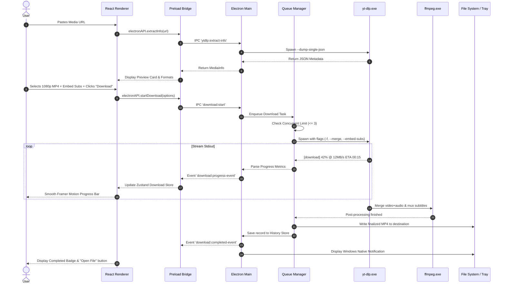

# PullTube — Technical Requirements Document (TRD)

| Document Version | Status   | Author                | Date       | Target Release |
| :--------------- | :------- | :-------------------- | :--------- | :------------- |
| 1.0.0            | Approved | PullTube Engineering  | 2026-09-19 | PullTube v1.0  |

---

## 1. System Architecture Overview

PullTube operates on the **Electron Multi-Process Architecture**, strictly enforcing security boundaries between the native Node.js runtime and the browser rendering context.

```
┌────────────────────────────────────────────────────────────────────────────────────────┐
│                                 ELECTRON MAIN PROCESS                                  │
│                                                                                        │
│  ┌────────────────────────┐  ┌───────────────────────────┐  ┌───────────────────────┐  │
│  │   App Lifecycle & OS   │  │   Download Queue Engine   │  │   Settings & Store    │  │
│  │ • BrowserWindow        │  │ • yt-dlp Process Pool     │  │ • electron-store      │  │
│  │ • Native System Tray   │  │ • FFmpeg Post-Processor   │  │ • Path Resolution     │  │
│  │ • Windows Notification │  │ • Stdout Parser / Regex   │  │ • yt-dlp Auto-Updater │  │
│  └───────────┬────────────┘  └─────────────┬─────────────┘  └───────────┬───────────┘  │
│              │                             │                            │              │
│              └──────────────────────┬──────┴────────────────────────────┘              │
│                                     │ IPC Channel Bus                                  │
└─────────────────────────────────────┼──────────────────────────────────────────────────┘
                                      │ contextBridge (Secure Bi-directional Bridge)
┌─────────────────────────────────────▼──────────────────────────────────────────────────┐
│                                PRELOAD SCRIPT (preload.ts)                             │
│                                                                                        │
│  • Exposes `window.electronAPI` safely to Renderer                                     │
│  • contextIsolation: true, nodeIntegration: false, sandbox: true                       │
└─────────────────────────────────────┬──────────────────────────────────────────────────┘
                                      │ Strongly-typed Window API
┌─────────────────────────────────────▼──────────────────────────────────────────────────┐
│                              RENDERER PROCESS (React 18 + TS)                          │
│                                                                                        │
│  ┌──────────────────────┐  ┌─────────────────────────────┐  ┌───────────────────────┐  │
│  │    Zustand Stores    │  │        Framer Motion        │  │   Tailwind CSS UI     │  │
│  │ • useDownloadStore   │  │ • Page Transitions          │  │ • Glassmorphism Theme │  │
│  │ • useSettingsStore   │  │ • Animated Progress Bars    │  │ • Sidebar Navigation  │  │
│  │ • useHistoryStore    │  │ • Status Badges & Cards     │  │ • Lucide Icons        │  │
│  └──────────────────────┘  └─────────────────────────────┘  └───────────────────────┘  │
└────────────────────────────────────────────────────────────────────────────────────────┘
```

### 1.1 Process Responsibilities
1. **Main Process (`src/main/`)**:
   - Manages desktop window life cycles, hardware acceleration, system tray, and native menus.
   - Spawns and supervises external CLI binaries (`yt-dlp.exe` and `ffmpeg.exe`).
   - Implements concurrent queue scheduling, active task cancellation, and stdout stream reading.
   - Persists state to disk via `electron-store` in the user's `AppData/Roaming/PullTube` directory.
   - Handles network proxy configurations and queries GitHub API for yt-dlp binary updates.

2. **Preload Layer (`src/preload/`)**:
   - Implements `contextBridge.exposeInMainWorld('electronAPI', {...})`.
   - Prevents DOM scripts from accessing Node.js `fs`, `child_process`, or raw IPC emitters.
   - Maps raw `ipcRenderer.invoke` and `ipcRenderer.on` calls into strictly typed async promises and unsubscribe callback listeners.

3. **Renderer Process (`src/renderer/`)**:
   - Single Page Application (SPA) driven by React 18 and Vite.
   - Uses Tailwind CSS 3 with custom glassmorphism directives.
   - Centralizes client state using Zustand stores.
   - Manages UI animations, form validations, format picking, and real-time download table updates.

---

## 2. Technology Stack & Version Dependencies

| Component | Library / Binary | Version Constraint | Rationale |
| :--- | :--- | :--- | :--- |
| **Desktop Runtime** | Electron | `^28.2.0` | Latest LTS with modern Chromium, Node.js 18+ and V8 optimizations |
| **Frontend Framework** | React | `^18.2.0` | Concurrent rendering, stable hooks, rich ecosystem |
| **Type Safety** | TypeScript | `^5.3.0` | End-to-end strict type checking across main, preload, and renderer |
| **Bundler / Build** | Vite + @vitejs/plugin-react | `^5.1.0` | Sub-second HMR during development, optimized Rollup bundle output |
| **Styling Engine** | Tailwind CSS | `^3.4.1` | Utility-first styling, JIT compilation, arbitrary glassmorphic opacities |
| **Motion Library** | Framer Motion | `^11.0.0` | Physics-based layout transitions, smooth progress bars, slide animations |
| **State Management**| Zustand | `^4.5.0` | Lightweight, zero boilerplate, performant outside-of-React subscriptions |
| **Iconography** | Lucide React | `^0.344.0` | Modern SVG icons matching the 24px/20px design grid |
| **Media Extraction**| yt-dlp Binary | `2024.08.06+` | Active fork of youtube-dl with rapid patch turnaround and 1000+ extractors |
| **Transcoder / Remux**| FFmpeg Binary | `^6.1.0` | Static builds of `ffmpeg.exe` and `ffprobe.exe` for merging & transcoding |
| **Persistence** | electron-store | `^8.1.0` | JSON-backed atomic file storage for user settings and download logs |
| **Installer Packager**| electron-builder | `^24.13.0` | Enterprise-grade NSIS installer packaging for Windows 64-bit |

---

## 3. yt-dlp Integration Details

### 3.1 Binary Resolution & Execution
PullTube locates `yt-dlp.exe` based on the execution context:
- **Development**: Resolved from `<projectRoot>/bin/yt-dlp.exe`.
- **Production (Packaged)**: Extracted or copied to the persistent writable path:  
  `%APPDATA%/PullTube/bin/yt-dlp.exe`.  
  *Rationale*: Storing the executable in the writable user directory enables in-place auto-updating without requiring administrator privileges or reinstalling the desktop application.

### 3.2 Metadata Extraction Flow
When the user pastes a URL, the Main process invokes `yt-dlp` in non-downloading extraction mode:

```bash
yt-dlp.exe \
  --dump-single-json \
  --no-playlist \
  --skip-download \
  --no-warnings \
  --ignore-errors \
  "<URL>"
```

The standard output is parsed into a structured JSON payload containing:
- `id`, `title`, `thumbnail`, `duration`, `uploader`, `view_count`
- Available format streams (`formats[]` with `format_id`, `ext`, `resolution`, `height`, `vcodec`, `acodec`, `filesize`, `fps`)
- Subtitle tracks (`subtitles{}` and `automatic_captions{}`)
- Chapter marks (`chapters[]` with `start_time`, `end_time`, `title`)

### 3.3 Format Selector Strategies
PullTube translates user selections into optimized yt-dlp format strings:

- **Best Quality Video (MP4)**:
  ```bash
  -f "bestvideo[ext=mp4]+bestaudio[ext=m4a]/bestvideo+bestaudio/best" --merge-output-format mp4
  ```
- **Selected Resolution (e.g. 1080p MKV)**:
  ```bash
  -f "bestvideo[height<=1080]+bestaudio/best[height<=1080]" --merge-output-format mkv
  ```
- **Audio Only Extraction (MP3 320k)**:
  ```bash
  -x --audio-format mp3 --audio-quality 0
  ```
- **Lossless Audio Extraction (FLAC / WAV)**:
  ```bash
  -x --audio-format flac --audio-quality 0
  ```

### 3.4 Progress Parsing Algorithm
PullTube attaches listeners to `childProcess.stdout` and uses regex pattern matching to extract granular progress metrics:

```typescript
// Regex matcher for standard yt-dlp download output
// e.g.: [download]  45.2% of ~ 150.25MiB at  12.45MiB/s ETA 00:07
const PROGRESS_REGEX =
  /\[download\]\s+(\d+\.?\d*)%\s+of\s+(?:~?\s*)(\d+\.?\d*)([KMGT]i?B)\s+at\s+(\d+\.?\d*)([KMGT]i?B\/s)\s+ETA\s+(\d{2}:\d{2}(?::\d{2})?)/i;

// Regex matcher for ffmpeg merge / conversion step
const POST_PROCESS_REGEX = /\[(Merger|ExtractAudio|EmbedSubtitle|FixupM3U8)\]/i;
```

When matched, an IPC event `download:progress` is dispatched to update the UI store with:
- `percentage: number`
- `downloadedSize: string`
- `totalSize: string`
- `speed: string`
- `eta: string`

---

## 4. FFmpeg Integration Details

### 4.1 Binary Bundling & Path Passing
FFmpeg is bundled alongside `ffprobe` in the application assets. When invoking `yt-dlp`, the path to the bundled FFmpeg directory is passed via:
```bash
--ffmpeg-location "<APPDATA>/PullTube/bin/ffmpeg.exe"
```

### 4.2 Post-Processing Operations
1. **Media Remuxing & Stream Merging**:
   Merges separate high-definition video-only streams (e.g., DASH 4K VP9) with highest-bitrate audio streams (e.g., Opus/M4A) into a single container without re-encoding (`-c copy`).
2. **Lossless Time Range Trimming**:
   When trimming is enabled, PullTube injects download section flags directly into yt-dlp, which delegates seek cutting to FFmpeg:
   ```bash
   --download-sections "*00:01:30-00:03:45" --force-keyframes-at-cuts
   ```
3. **Chapter Splitting**:
   ```bash
   --split-chapters
   ```
4. **Metadata & Artwork Embedding**:
   ```bash
   --embed-metadata --embed-thumbnail --embed-subs --sub-langs "en.*,es.*"
   ```

---

## 5. IPC Communication Protocol

All IPC channels are strongly typed. No dynamic untyped channel names or payloads are permitted.

```
Renderer Process ────(ipcRenderer.invoke)────► Preload Bridge ────(ipcRenderer.send)────► Main Process
                                                                                               │
Renderer Process ◄───(State Listener)───────── Preload Bridge ◄───(event.sender.send)─────────┘
```

### 5.1 Typed Channel Definitions

```typescript
export interface IPCChannels {
  // Metadata & Media
  'ytdlp:extract-info': {
    request: { url: string };
    response: { success: boolean; data?: MediaInfo; error?: string };
  };

  // Download Job Execution
  'download:start': {
    request: DownloadOptions;
    response: { success: boolean; downloadId: string; error?: string };
  };
  'download:pause': {
    request: { downloadId: string };
    response: { success: boolean };
  };
  'download:resume': {
    request: { downloadId: string };
    response: { success: boolean };
  };
  'download:cancel': {
    request: { downloadId: string };
    response: { success: boolean };
  };

  // Push Events from Main to Renderer
  'download:progress-event': {
    eventPayload: {
      downloadId: string;
      percentage: number;
      speed: string;
      eta: string;
      downloadedBytes: number;
      totalBytes: number;
      status: DownloadStatus;
    };
  };
  'download:completed-event': {
    eventPayload: {
      downloadId: string;
      filePath: string;
      fileSize: number;
    };
  };
  'download:error-event': {
    eventPayload: {
      downloadId: string;
      error: string;
    };
  };

  // Configuration & Settings
  'settings:get': {
    request: void;
    response: AppSettings;
  };
  'settings:set': {
    request: Partial<AppSettings>;
    response: { success: boolean; settings: AppSettings };
  };
  'settings:select-directory': {
    request: void;
    response: { canceled: boolean; selectedPath?: string };
  };

  // Engine Maintenance
  'ytdlp:check-update': {
    request: void;
    response: { currentVersion: string; latestVersion: string; updateAvailable: boolean };
  };
  'ytdlp:perform-update': {
    request: void;
    response: { success: boolean; newVersion?: string; error?: string };
  };

  // OS Shell Integrations
  'shell:open-file': {
    request: { filePath: string };
    response: { success: boolean; error?: string };
  };
  'shell:show-in-folder': {
    request: { filePath: string };
    response: { success: boolean };
  };

  // Window Controls
  'window:minimize': { request: void; response: void };
  'window:maximize': { request: void; response: { isMaximized: boolean } };
  'window:close': { request: void; response: void };
}
```

### 5.2 Core Data Interfaces

```typescript
export type DownloadStatus = 
  | 'queued' 
  | 'fetching-info' 
  | 'downloading' 
  | 'processing' 
  | 'completed' 
  | 'paused' 
  | 'cancelled' 
  | 'error';

export interface MediaFormatOption {
  formatId: string;
  ext: string;
  resolution: string;
  filesizeApprox?: number;
  vcodec?: string;
  acodec?: string;
  fps?: number;
}

export interface MediaInfo {
  url: string;
  title: string;
  thumbnail: string;
  duration: number; // in seconds
  uploader: string;
  viewCount: number;
  availableVideoFormats: MediaFormatOption[];
  availableAudioFormats: MediaFormatOption[];
}

export interface DownloadOptions {
  url: string;
  title: string;
  thumbnail: string;
  mode: 'video' | 'audio';
  format: 'mp4' | 'mkv' | 'webm' | 'avi' | 'mp3' | 'flac' | 'wav' | 'aac' | 'ogg' | 'alac';
  quality: string; // e.g. "1080p", "best", "320k"
  destinationPath: string;
  // Advanced toggles
  extractAudioOnly: boolean;
  embedSubtitles: boolean;
  subtitleLanguage?: string;
  embedThumbnail: boolean;
  embedMetadata: boolean;
  splitChapters: boolean;
  trim: {
    enabled: boolean;
    startTime?: string; // HH:MM:SS
    endTime?: string;   // HH:MM:SS
  };
}

export interface AppSettings {
  downloadDirectory: string;
  maxConcurrentDownloads: number;
  proxy: {
    enabled: boolean;
    url: string;
  };
  theme: 'dark' | 'light';
  closeToTray: boolean;
  minimizeToTray: boolean;
  enableNotifications: boolean;
  ytdlpAutoUpdate: boolean;
}
```

---

## 6. End-to-End Download Lifecycle



---

## 7. State Management Architecture

PullTube utilizes **Zustand** stores inside the renderer process. Zustand was selected over Redux or Context API because it operates with zero boilerplate, renders selectively without parent re-renders, and enables state mutation from both React components and asynchronous IPC subscription callbacks.

### 7.1 Store Division
1. **`useDownloadStore`**:
   - `queue: Record<string, DownloadItem>`: In-memory registry of all active, queued, and downloading media.
   - `activeDownloadsCount: number`: Tracks active jobs against concurrency limit.
   - Actions: `addDownload()`, `updateProgress()`, `markComplete()`, `markError()`, `pauseDownload()`, `cancelDownload()`.
2. **`useSettingsStore`**:
   - Holds runtime copy of `AppSettings`.
   - Actions: `loadSettings()`, `updateSetting(key, val)`, `setDownloadDirectory()`.
3. **`useHistoryStore`**:
   - History logs: `historyItems: HistoryItem[]`.
   - Actions: `loadHistory()`, `removeHistoryItem()`, `clearHistory()`, `searchHistory(query)`.
4. **`useUIStore`**:
   - Manages active navigation tab (`home`, `downloads`, `history`, `settings`), active modal dialogs, and toast notifications.

---

## 8. Persistence Architecture

Local persistence relies on `electron-store`, which provides atomic JSON writing to disk to prevent state corruption in case of sudden power loss or process termination.

### 8.1 Storage Files & Schemas
- **Settings Store (`%APPDATA%/PullTube/settings.json`)**:
  Stores user preferences, concurrency limits, default paths, and proxy options.
- **History Store (`%APPDATA%/PullTube/history.json`)**:
  Stores an array of completed downloads with attributes:
  ```typescript
  export interface HistoryItem {
    id: string;
    url: string;
    title: string;
    thumbnail: string;
    filePath: string;
    fileSize: number;
    format: string;
    resolution: string;
    downloadedAt: number; // Epoch timestamp
  }
  ```

---

## 9. Error Handling & Recovery Matrix

| Fault Condition | Detection Trigger | Recovery Mechanism | User Communication |
| :--- | :--- | :--- | :--- |
| **Network Disconnection** | yt-dlp `[Errno 11001] getaddrinfo failed` or socket reset | Automatically retried up to 3 times with exponential backoff (2s, 4s, 8s) | Status badge displays "Retrying (1/3)..." |
| **Site Extractor Deprecated** | HTTP 403 Forbidden or YouTube Signature extraction failure | Prompts automatic background `yt-dlp -U` engine update check | Toast notification: *"Extracting signature failed. Checking for engine update..."* |
| **Insufficient Disk Space** | OS `ENOSPC` errno during stream write | Download paused immediately, temporary file retained | Modal alert: *"Drive is full. Free space and click Resume."* |
| **Geo-restricted Media** | yt-dlp `Video unavailable in your country` | Task aborted without retry | Detailed banner suggesting configuring SOCKS5 proxy in Settings |
| **FFmpeg Missing / Incompatible** | Spawn error `ENOENT` | Fallback to unmerged native streams | Alert instructing user to verify bundled binary integrity |

---

## 10. Security & Hardening Specifications

1. **Chromium Sandboxing & Context Isolation**:
   - `webPreferences.contextIsolation = true`: Mandatory barrier separating DOM from Electron internals.
   - `webPreferences.nodeIntegration = false`: Disables Node primitives (`require`, `process`, `Buffer`) in renderer.
   - `webPreferences.sandbox = true`: Sandboxes the renderer Chromium process.
2. **Content Security Policy (CSP)**:
   The renderer HTML includes a strict CSP header:
   ```html
   <meta http-equiv="Content-Security-Policy" content="
     default-src 'self';
     script-src 'self';
     style-src 'self' 'unsafe-inline';
     img-src 'self' https: data:;
     media-src 'self' file:;
     connect-src 'self';
   ">
   ```
3. **Execution Parameter Sanitization**:
   URLs are strictly validated via standard URL parser (`new URL(rawUrl)`) before being forwarded to `child_process.spawn`. All CLI parameters are passed as distinct array arguments—never executed via `exec()` or concatenated shell string invocations, eliminating command injection vulnerabilities.

---

## 11. Performance Benchmarks & Targets

- **IPC Latency**: Time to dispatch and receive an IPC progress event under 4 milliseconds.
- **Progress Throttling**: While yt-dlp outputs progress multiple times per second, the Main process throttles renderer notifications to **60ms intervals** to prevent React re-rendering churn.
- **Clean Exit Cleanup**: When a download is cancelled or the app is closed, all child process trees are sent `SIGTERM`/`SIGKILL` signals and intermediate `.part` files are removed to prevent orphaned disk usage.
